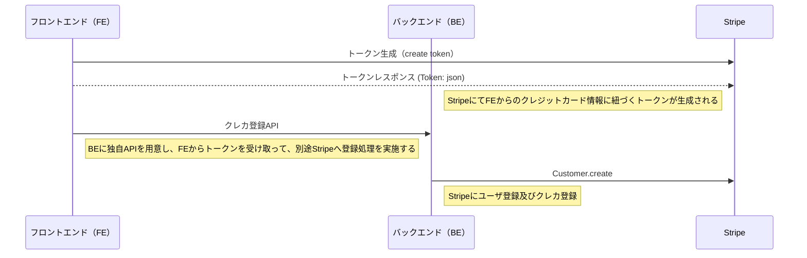

# 環境構築

## Version

- React v18.2.0
- Next v12.2.3
- TailwindCSS v3.1.6

## Installation

```bash
$ yarn
```

## Running the app

```bash
# development
$ yarn dev

# production mode
$ yarn build
$ yarn start:build
```

# デザインパターン

## コンポーネント設計

- コンテナ・プレゼンテーションパターンの採用
- React コンポーネントの実装方法は、[経年劣化に耐える ReactComponent の書き方](https://qiita.com/Takepepe/items/41e3e7a2f612d7eb094a)を参考にさせていただいている

  ```tsx
  ├── components　・・・ コンポーネントをまとめるディレクトリ
  │   ├── Header  ・・・ あるコンポーネントのディレクトリ
  │   │   ├── Header.tsx ・・・ Container層として、ロジックを定義するファイル
  │   │   └── Presenter.tsx ・・・ Container層から表示に必要なpropsを受領し、画面表示するためのファイル
  │   │   └── index.ts ・・・ コンポーネントを出力するファイル
  │   ├── helper  ・・・ 複数のコンポーネントから利用されるコンポーネントの管理ディレクトリ
  ```

# 機能

## 表形式

- [Zenn の記事はこちら](https://zenn.dev/ikefukurou777/articles/7e5f96a26d530e)
- URL：/tablar-form
- React Hook Form の useFieldArray を使用して、複数テーブルの入力とエラー制御の実装サンプル
  - React Hook Form: v7.34.0
- insert メソッドを使って、明示的に指定した位置に新規行を追加する機能

## Stripe 決済

### クレジットカード登録

- URL：/payment
- React 用の Stripe ライブラリを使用して、クレジットカード登録用の実装サンプル（[公式サイト](https://stripe.com/docs/stripe-js/react)）
- クレジットカード情報を入力する UI に関しては、スタイリングを柔軟にしたいため、カード番号、カード有効期限、セキュリティコードそれぞれの分割されたコンポーネントを使用している
- 処理方式としては、フロントエンドと Stripe で完結させるのではなく、Stripe から生成されたトークンを取得し、それをバックエンドの API に渡す方針としている


